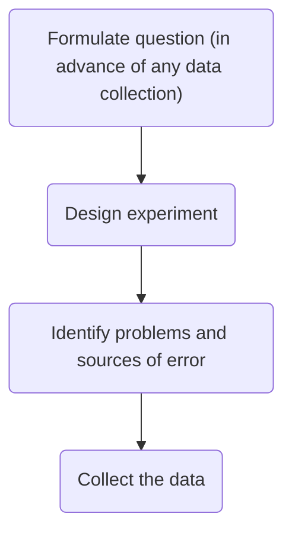

## Experimental Design Meaning

Experimental design is organizing an experiment so that you have the correct data (and enough of it!) to clearly and effectively answer your data science question. This process involves clearly formulating your question in advance of any data collection, designing the best set-up possible to gather the data to answer your question, identifying problems or sources of error in your design, and only then, collecting the appropriate data.

## Principles of Experimental Design

**Independent variable (AKA factor):** The variable that the experimenter manipulates; it does not depend on other variables being measured. Often displayed on the x-axis.

**Dependent variable:** The variable that is expected to change as a result of changes in the independent variable. Often displayed on the y-axis, so that changes in X, the independent variable, effect changes in Y.

So when you are designing an experiment, you have to decide what variables you will measure, and which you will manipulate to effect changes in other measured variables. Additionally, you must develop your **hypothesis**, essentially an educated guess as to the relationship between your variables and the outcome of your experiment. Gives a sense of what we are trying to arrive at.

**Confounder:** An extraneous variable that may affect the relationship between the dependent and independent variables.

We need to **==control==** for **confounders**.

In other experimental design paradigms, a **control group** may be appropriate. This is when you have a group of experimental subjects that are _not_ manipulated. So if you were studying the effect of a drug on survival, you would have a group that received the drug (**treatment**) and a group that did not (**control**). This way, you can compare the effects of the drug in the treatment versus control group.

**A control group is a group of subjects that do not receive the treatment, but still have their dependent variables measured**

**==Blinding== your study means that your subjects don’t know what group they belong to - all participants receive a “treatment”**. This is effective to control for **placebo effect**.

“Balancing” of confounders is often achieved by **randomization**. Generally, we don’t know what will be a confounder beforehand; to help lessen the risk of accidentally biasing one group to be enriched for a confounder, you can randomly assign individuals to each of your groups. This means that any potential confounding variables should be distributed between each group roughly equally, to help eliminate/reduce systematic errors.

**==Randomizing ==subjects to either the control or treatment group is a great strategy to reduce confounders’ effects**

There is one final concept of experimental design that we need to cover in this lesson, and that is **==replication==**. Replication is pretty much what it sounds like, repeating an experiment with different experimental subjects. A single experiment’s results may have occured by chance; a confounder was unevenly distributed across your groups, there was a systematic error in the data collection, there were some outliers, etc. However, if you can repeat the experiment and collect a whole new set of data and _still_ come to the same conclusion, your study is much stronger. Also at the heart of replication is that it allows you to measure the **variability** of your data more accurately, which allows you to better assess whether any differences you see in your data are significant.

## P-hacking
The **p-value** tells us the probability that the results of the experiment were observed by chance. A lower p-value would imply a lower probability that the observed differences negating the null hypothesis were observed just by chance. A higher p-value affirms the null hypothesis and is caused by noise.

What you need to look out for is when you manipulate p-values towards your own end. Often, when your p-value is less than 0.05 (in other words, there is a 5 percent chance that the differences you saw were observed by chance), a result is considered [significant](https://xkcd.com/1478/). But if you do 20 tests, by chance, you would expect one of the twenty (5%) to be significant. In the age of big data, testing twenty hypotheses is a very easy proposition. And this is where the term [p-hacking](https://en.wikipedia.org/wiki/Data_dredging) comes from: This is when you exhaustively search a data set to find patterns and correlations that appear statistically significant by virtue of the sheer number of tests you have performed. These spurious correlations can be reported as significant and if you perform enough tests, you can find a data set and analysis that will show you what you wanted to see.
